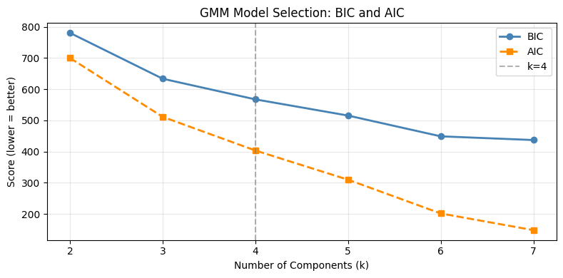
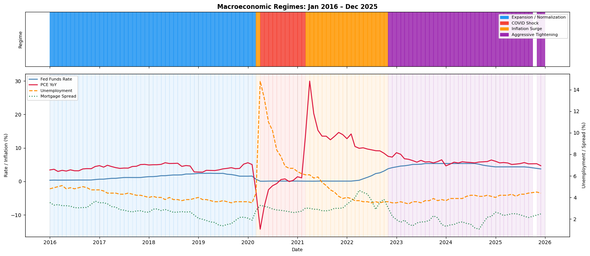
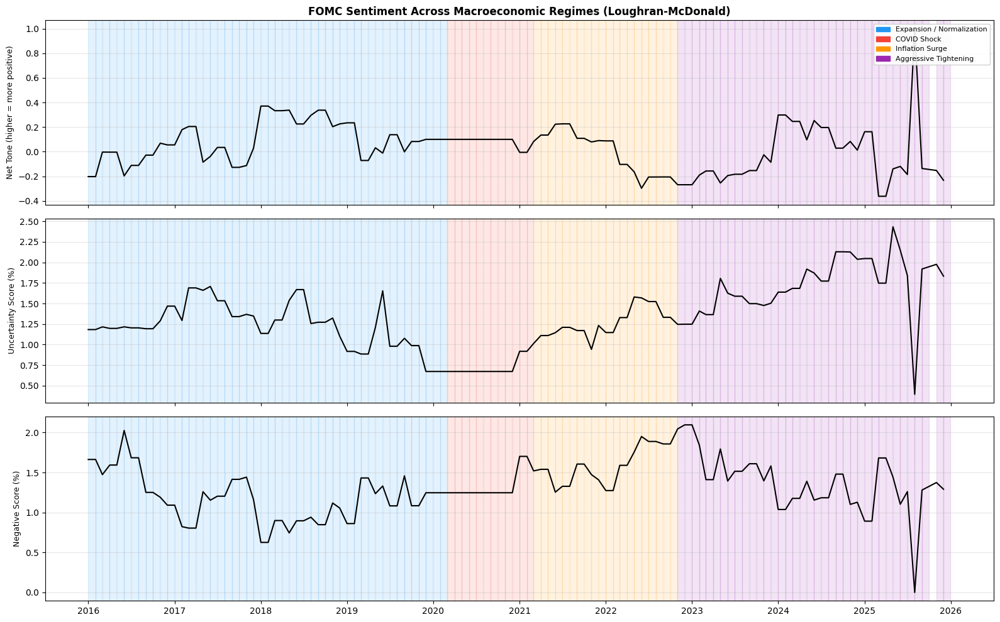
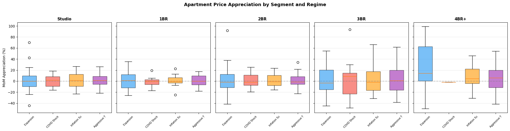

# Manhattan Housing Market Dynamics Across Economic Regimes

## Executive Summary
The Manhattan residential real estate market is among the most closely watched housing markets in the United States, generating tens of billions of dollars in annual transaction volume and serving as a bellwether for broader urban housing conditions. Its performance is closely tied to the national economy: monetary policy shapes borrowing costs and credit access, while inflation and employment conditions influence household purchasing power and demand. 

This study constructs a monthly panel of Manhattan apartment sales from **January 2016 through December 2025** and links each transaction to the prevailing macroeconomic environment. The macroeconomic environment is measured using two complementary sources:
1. Established Federal Reserve indicators.
2. Textual sentiment extracted from Federal Open Market Committee (FOMC) minutes and policy statements. 

The analysis applies a multi-phase framework including unsupervised clustering to identify economic regimes, statistical testing to assess whether price differences vary across regimes, and Random Forest models to compare forecasting performance.

---

## Research Problem
The study addresses three critical questions, each corresponding to a phase of the analysis:

1. **Identification of economic regimes:** Do the Federal Funds Rate, unemployment rate, PCE inflation, and mortgage spread cluster into distinct macroeconomic regimes, and does FOMC sentiment align with the identified regime structure?
2. **Segment-level price response:** Do Manhattan apartment prices differ across the identified regimes, and do those differences vary by apartment type and location?
3. **Value of regime recognition:** Does incorporating regime classification and textual sentiment improve the prediction of apartment price movements over a specification using macroeconomic indicators alone?

---

## Data & Preparation
This project integrates three distinct datasets spanning January 2016 through December 2025:

* **Housing Transaction Data:** Property sale records for Manhattan apartments compiled from 120 standardized Excel exports. Transactions are aggregated to the Month × Sub-Neighborhood × Bedroom Count level to preserve segment-level variation and avoid Simpson's paradox.
* **Macroeconomic Indicators:** Leading economic indicators from the Federal Reserve Economic Data (FRED) API, including the Federal Funds Rate (FEDFUNDS), Unemployment Rate (UNRATE), Year-Over-Year Personal Consumption Expenditures (PCE_YOY), and Mortgage Spread (MORTGAGE30US - FEDFUNDS).
* **FOMC Textual Data:** Scraped official FOMC minutes and policy statements (146 documents). The Loughran-McDonald financial dictionary was applied to extract Positive, Negative, Subjectivity, and Polarity sentiment scores.

---

## Analytical Approach

### Phase 1: Regime Identification
The first phase clusters monthly macroeconomic and sentiment variables into distinct, interpretable regimes. **Gaussian Mixture Modeling (GMM)** was selected over K-means for this task because:
* GMM models each regime as a multivariate Gaussian, allowing for non-spherical cluster shapes and varying sizes.
* GMM produces probabilistic cluster memberships better representing how economic environments actually transition through periods of partial overlap.
* Model complexity can be selected through formal information criteria (BIC/AIC).

*Fig 1: Evaluation of GMM model complexity. Bayesian Information Criterion (BIC) and Akaike Information Criterion (AIC) scores were used to determine the optimal number of latent economic regimes.*

*Fig 2: The mapping of identified regimes against the Federal Funds Rate highlights how distinct periods—such as the zero-interest rate environments versus aggressive hiking cycles—were successfully isolated and categorized by the GMM clustering algorithm.*

*Fig 3: Analysis of FOMC textual sentiment scores mapped onto the identified macroeconomic regimes.*

### Phase 2: Segment-Level Heterogeneity Testing
To test whether apartment prices differ across regimes and whether those differences vary by segment, a **two-way Analysis of Variance (ANOVA)** was utilized. By testing the interaction term between `Regime` and `Bedroom Count`, we evaluated if the effect of regime on price depends on the apartment type.

**Findings:** The results reveal that when all apartments are pooled, average prices show no statistically significant shift. However, the interaction between regime and bedroom count is highly significant. 

*Fig 4: Splitting the property segment by bedroom count reveals that larger apartments (e.g., 3+ beds) exhibit noticeably wider structural pricing shifts across regimes, while smaller units (0-1 beds) possess a more resilient and stable pricing band.*

### Phase 3: Predictive Modeling
We evaluated predictive accuracy using a **Random Forest regressor** to capture non-linear macroeconomic relationships and feature interactions without requiring explicit specification.

We compared three models predicting log-transformed median sale price:
1. **Baseline Model:** Using macro numbers and segment fixed effects.
2. **Sentiment-Aware Model:** Added FOMC Loughran scores.
3. **Regime-Aware Model:** Added the discrete Regime classifications from Phase 1.

**Findings:** Incorporating regime classification significantly reduces next-month price prediction error (RMSE) relative to a specification using macroeconomic indicators alone.

*Fig 5: Feature importances of the winning model. While structural traits of the property itself (Bedrooms) were the dominant determinants of price, the identified Regimes classification variables carried significantly more weight than foundational metrics alone.*

---

## Conclusions and Recommendations

### Key Takeaways
1. **Regimes Matter Segmentally, Not Universally:** The data clearly demonstrates that economic macro-regimes affect the Manhattan market unevenly. Larger units (3+ beds) carry greater downside exposure during restrictive regimes, while entry-level studios/one-bedrooms provide price stability through tightening cycles.
2. **Value of Regime Classification:** Regime labels encode crucial information about price dynamics that raw macroeconomic variables and textual sentiment do not capture on their own.

### Recommendations for Decision Makers
* **For Real Estate Investors:** Portfolio allocation should reflect the prevailing regime: tighter regimes warrant overweighting smaller segments (studios and 1-beds) that offer stability, while accommodative regimes open up upside in larger multi-bedroom units.
* **For Mortgage Underwriters & Risk Analysts:** Underwriting models that assume uniform price behavior across apartment types will systematically underprice risk in larger units during periods of monetary tightening. Segment-level price sensitivity should drive loan-to-value assumptions.
* **For Forecasters:** Discrete regime classification captures nonlinear macroeconomic effects more efficiently than raw macro indicators alone. Regime-aware models should become standard for segment-level forecasting applications.

---

## Limitations
* **Regime stability depends on historical coverage:** With a ten-year window (2016-2025), extreme regimes (e.g., COVID shock, peak tightening) are observed only briefly.
* **Aggregation masks within-segment variation:** Using median prices smooths out property-specific characteristics (age, renovation status) that would require hedonic controls not present in this dataset.
* **Sentiment features showed limited marginal value:** Adding textual sentiment scores on their own provides minimal improvement over macro-only prediction; their true value is absorbed during regime construction.

---
*Note: A synthesis dashboard was developed to complement this report, providing an interactive front-end web application that visualizes the regime models and transaction data distributions.*
